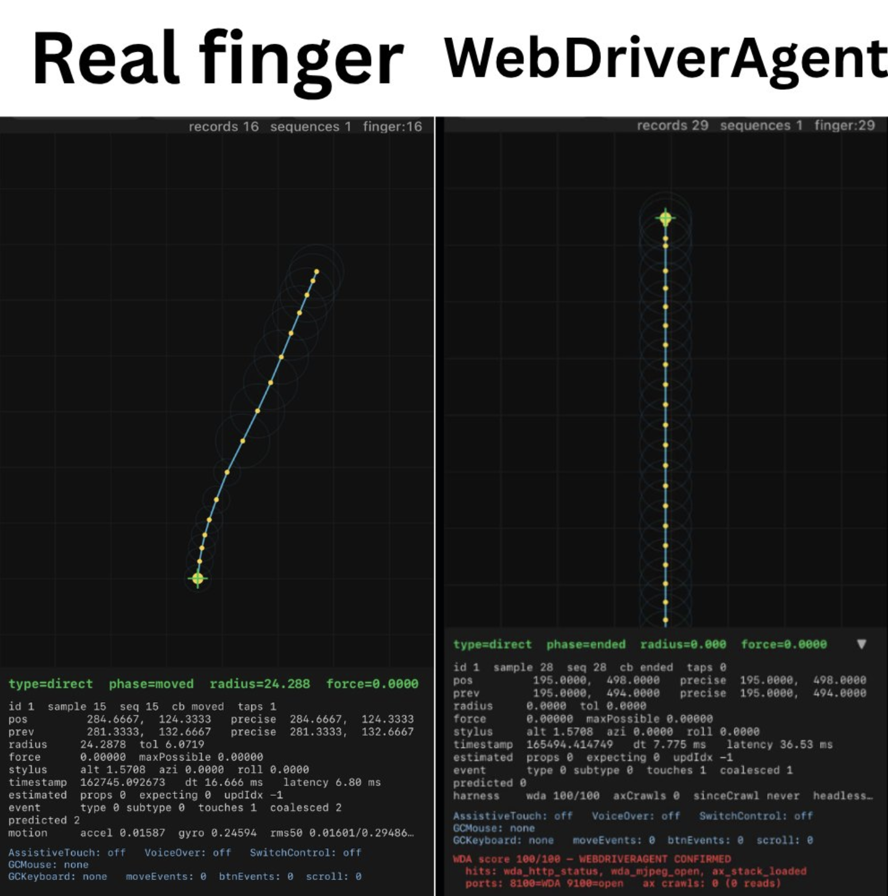

# Touch Signal

Native iOS touch-gesture inspector with live trails and telemetry.

## Features

- Live grid, path, contact-radius, and endpoint display
- Touch position, force, timing, and multi-touch telemetry
- WebDriverAgent gesture detection from sustained zero-radius and zero-force samples
- Clear diagnostics view for accessibility and automation signals

## Run

Open `TouchSignal.xcodeproj` in Xcode and run on iOS 17+.

The WDA verdict evaluates touch geometry throughout `began` and `moved`. A swipe is confirmed only when both radius and force remain zero across multiple samples. The final `ended` sample is excluded because iOS may report zero geometry for a real finger when it lifts.
